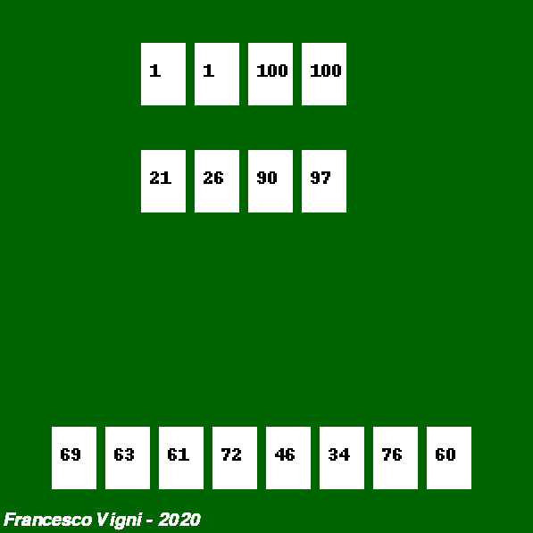

# The Game
Python implementation of The Game by Steffen Benndorf [source](https://boardgamegeek.com/boardgame/182453/game)


The player needs to discard all 98 cards in the deck onto four discard piles in order to win, but need to do so in the right way.
This game is currently made only for one player, but can be extended to multiple players. 
A card from the _hand_ can be placed on one of the decks [1, 1, 100, 100] according to the rule of the specific pile.


Cards appended on the piles _one_ [1] need to increase in value or has the same value of the one in the pile - 10.
Cards appended on the piles _hundred_ [100] need to decrease in value or has the same value of the one in the pile + 10.


## The game window


---

## How to run
Tested with Python 3.7.7

```python
python main.py
```

## Todo
- Handle and sanitize all possible user inputs
- Write tests
- Check game logic
- Add repeated cards
- Add cards for The Game is on Fire
- Attach logic to a GUI


 pyreverse <script> -o diagram.png
