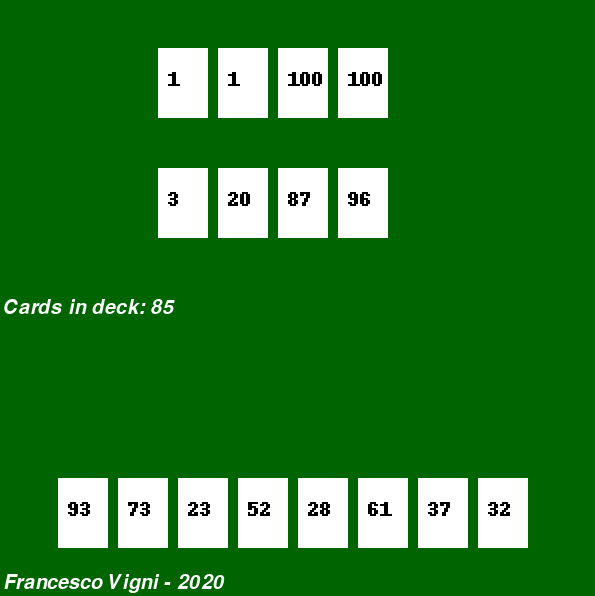

# The Game
Python implementation of The Game by Steffen Benndorf

## The game window


---
## Class diagram


---

## How to run
Tested with Python 3.7.7

```python
python main.py
```

## Todo
- Handle and sanitize all possible user inputs
- Write tests
- Check game logic
- Add repeated cards
- Add cards for The Game is on Fire
- Attach logic to a GUI


 pyreverse <script> -o diagram.png